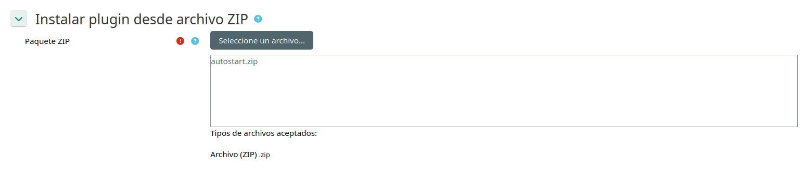

# Plugin de inicio automático para cuestionarios

[Read on english](README.md)

Este plugin facilita que los estudiantes accedan de inmediato a ciertos cuestionarios marcando la casilla de "inicio automático", lo que crea una experiencia más fluida al evitar pasos adicionales antes de responder.

## Características principales
- El acceso a cuestionarios comienza en cuanto el estudiante entra a la actividad.
- Funciona para los cuestionarios que admiten esta regla de acceso, pudiendo activarse y desactivarse a voluntad del profesor
- Ideal para realizar cuestionarios que contienen tanto contenido como preguntas pero que no necesesariamente pretenden ser evaluaciones

## Para compilar este plugin

1. Comprime el directorio `autostart` en formato `.zip`.
2. Moodle leerá ese ZIP como un paquete de plugin.
3. Si el ZIP corresponde a una versión estable, publícalo como release para mantener el control de versiones.

## Instalar en una plataforma Moodle

1. Desde el panel de administración, ve a “Extensiones > Instalar complementos” y sube el archivo `.zip`.
2. Usa el asistente para completar la instalación y verificar los ajustes necesarios.

## Alternativa para desarrollo

También puedes copiar el directorio `autostart` directamente en la ruta `mod/quiz/accessrule/` dentro de la raíz de Moodle. Esta opción acelera el ciclo de pruebas y evita tener que comprimir el plugin en cada cambio.

## Licencia

Este proyecto se publica bajo la licencia MIT. Consulta el archivo `LICENSE` para más detalles.